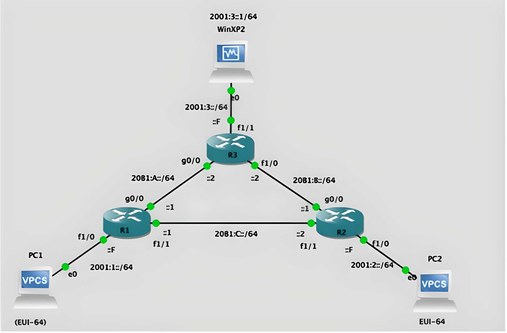

> "¿Habrá algo más horrible que la combinación de ACL e IPv6? Sí, intentar explicar la computación cuántica a un gato."
>     -   ChatGPT (2023)

### Consideraciones
- No existe Standard ACL en IPv6, solo `Extended ACL`.
- Solo esta disponible el modo `named` para configurar ACLs.
- No hay wildcards in IPv6, cada ACE se escribe en formato CIDR.
- Aplicación de las ACL
	- IPv4: `ip access-group`
	- IPv6: `ipv6 traffic-filter`
### Consigna


### GNS3



### Solución

1. El PC2 debe responder PINGs solamente desde la LAN de R3
``` bash
R2(config)$ ipv6 access-list POLITICAS
R2(config-ipv6-acl)$ permit icmp 2001:3::/64 <IPv6_PC2> 

## Como existe un deny implicito al final, no es necesario agregar más instrucciones

# Configuración en base a la salida (out) de la interface
R2(config)$ int f1/0
R2(config-if)$ ipv6 traffic-filter POLITICAS out
```

2. El PC de la LAN R3 debe acceder solamente a la interfaz Web de R3. Para todos los otros sitios Web, el acceso debe estar bloqueado
``` bash
R3(config)$ ipv6 access-list PERMITE_HTTP
R3(config)$ permit tcp 2001:3::1/64 2001:3::F/64 eq 80
R3(config)$ deny tcp 2001:3::1/64 any eq 80
R3(config)$ permit any any

R3(config)$ int f1/1
R3(config-if)$ ipv6 traffic-filter PERMITE_HTTP in
```

3. PC1 no debe poder acceder de ningún modo a la LAN de R3
``` bash
R1(config)$ ipv6 access-list NEGAR_LAN3
R1(config)$ deny <IPv6_PC1> 2001:1:3::/64
R1(config)$ permit any any

R1(config)$ int f1/0
R1(config-if)$ ipv6 traffic-filter NEGAR_LAN3 in
```