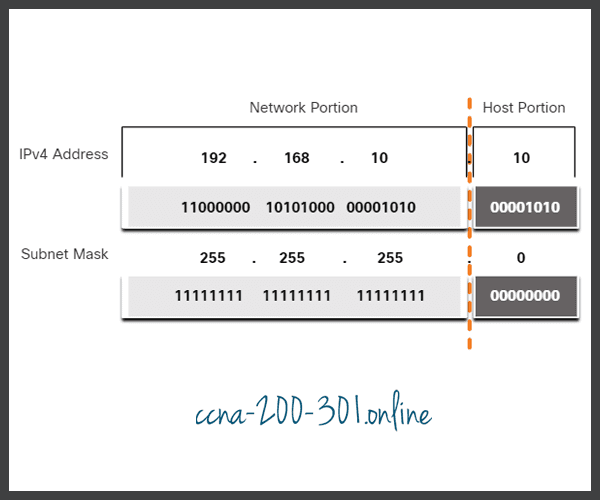

Las IP nos sirven para poder identificarnos en la red. Generalmente se compone de cuatro octetos (8 bits) dado por: 
_Porción de RED + Porcion de HOST_

Para poder identificar la Network Portion  y la Host Portion se usa la Subnet Mask

# TODO: agregar concepto de peso en el sistema binario

# IP address range

# Calcular IPs disponibles para host
Esto se hace usando la formula $2^{x}$ siendo $x$ la cantidad de bits disponibles en la porción de host. 
- Por ejemplo en un rango clase A, tenemos 24 bits. Entonces tenemos disponibles $2^{24}$ host disponibles, es decir $16.777.216$ hosts disponibles
- Por ejemplo en un rango clase B, tenemos 16 bits. Entonces tenemos disponibles $2^{16}$ host disponibles, es decir $65.536$ hosts disponibles
- Por ejemplo en un rango clase C, tenemos 8 bits. Entonces tenemos disponibles $2^8$ host disponibles, es decir $256$ hosts disponibles

# Tipos de Ip address
- Direccion de red  (dirección de host AND subnet mask)
- Direccion de enlace (es la dirección siguiente a la dirección de red)
- Direcciones IP de Host
- Direcciones IP de Gateway (Puerta de enlace)
- Direcciones Broadcast
- Wildcard (subnet mask OR 255.255.255.255 )

# Direccionamiento de la red
Cuando hay dispositivos conectados a un switch forman parte de la misma red.
En cambia si hay dispositivos conectados a un router. Cada dispositivo esta en una red independiente. Aun solo sea un dispositivo.
