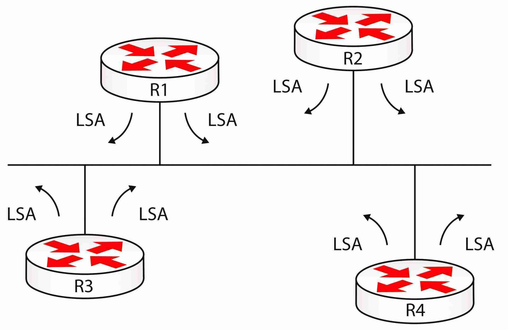
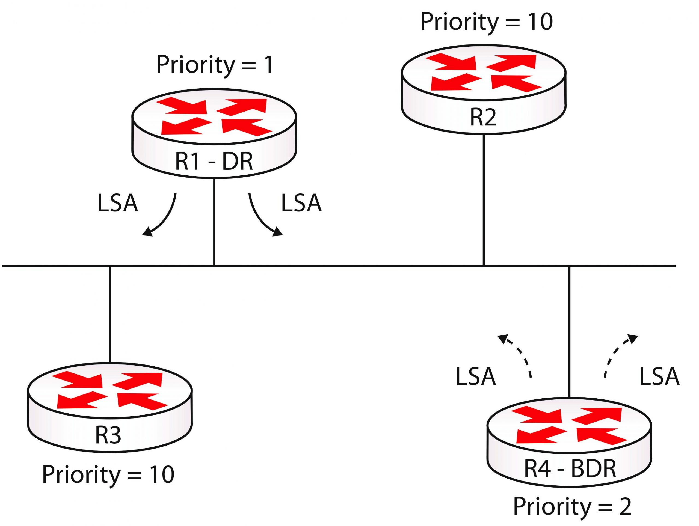
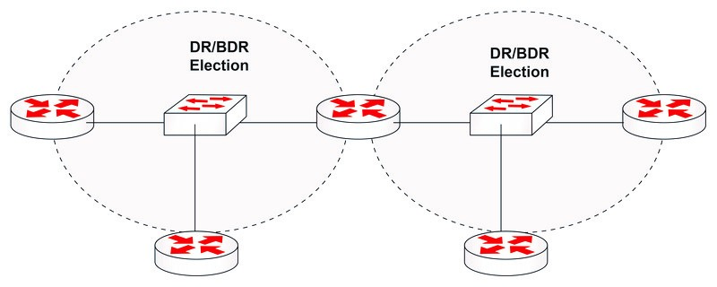

---
tags:
  - dynamic
  - OSPF
  - routing
---

En redes broadcast como ethernet, no es eficiente que [OSPF](OSPF.md) inunde los enlaces con anuncios a cada uno de los vecinos, tampoco es conveniente que cada router se haga un router adyacente. Esto es porque cada router tendria que enviar LSAs a todos los demas routers, consumiendo memoria, CPU y ancho de banda. 

Sin un _Designated Router (DR)_ y un _Backup Designated Router (BDR_ en la red broadcast, puede generar una situación similar a la imagen.

La [adjacency](adjacency.md) en esta red es de 6, cada uno de estos routers intercambia $n-1$ LSAs (siendo $n$ la cantidad de routers) lo cual hace que gran parte del bandwidth se dedique al trafico [OSPF](OSPF.md). En cambio, una vez agregado un DR la situación se ve así:

> red broadcast con un DR

En este caso, [OSPF](OSPF.md) elige un router como DR el cual escucha los LSA en multicast `224.0.0.6` e inundará en `224.0.0.5`. Tambien hay un BDR en caso de que el BR falle por cualquier motivo, los routers nuevos que se unan a la red OSPF formaran [adjacency](adjacency.md) solo con el DR y el BDR, lo cual crea redundancia. 

Los DR/BDR suelen complir:
- Reducir el número de [adjacency](adjacency.md) requeridas en el segmento
- Anunciar a los routers en el segmento multi-access
- Asegurar que los updates se envian a todos los routers del segmento 

Los routers que no son DR/BDR se los lista como _DRother_ y solo establecen [adjacency](adjacency.md) con el DR/BDR. 

Todo esto tiene lugar por cada red multi-access, cada uno con su respectivo DR/BDR. 

