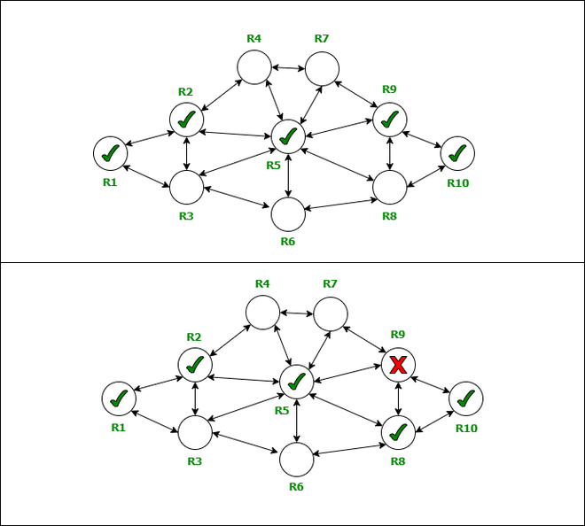

---
tags:
  - CCNA
---

- Cada uno de los router informa a todos sus vecinos sobre las rutas que tiene conectadas.
- Despues los routers comienzan a escanear y analizar los servicios

> A nivel CCNA, el enfoque esta en el protocolo IGP (_Ver: [IGPs](IGPs.md)_).

- Classful: los protocolos que funcionan observando las clases IP. Algo lo cual hoy en dia es obsoleto y por eso todos los protocolos que mantienen este forma, tambien. 
	- RIPv1: hoy en dia esta deprecated por temas de rendimiento y limitación. Es un protocolo estandar (definido por el IEEE).
	- IGRP: propietario de Cisco, tambien deprecated. 
- Classless: el enrutameinto se realiza sin clases (CIDR)
	- RIPv2: estandar por el IEEE (_Ver: [RIPv2](RIPv2.md)_)
	- EIGRP: propietario de Cisco
	- IS-IS: protocolo usado generalmente en ISP.
	- OSPF: de uso masivo, estandar.

## IGPs
- [IGPs](IGPs.md)
- [IGPs y EGPs](IGPs%20y%20EGPs.md)