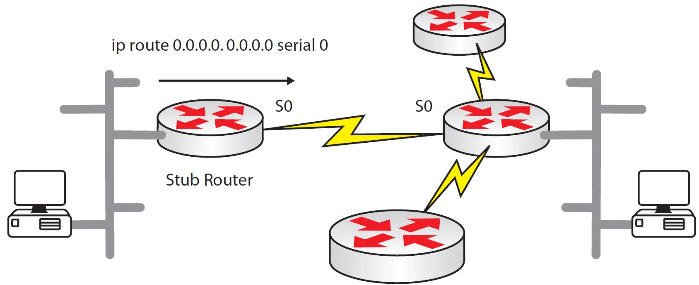

---
tags:
  - routing
  - static
---

Este comando resulta util para configurar varias rutas sin necesidad de  especificar cada una. En el ejemplo podemos configurar con un solo comando todas la rutas necesarias solo especificando la interface de salida, en este caso, `S0` en `stub router`.

``` bash
Router(config)#ip route 0.0.0.0 0.0.0.0 Serial0

Con un next-hop IP, suponiendo que el router vecino tiene esa IP
Router(config)#ip route 0.0.0.0 0.0.0.0 192.168.1.2
```

Los 0s indican cualquier red en cualquier subnet mask. Eso quiere decir que cualquier trafico que pase por el router puede pasar por la next-hop IP (o interface).  


> Incluso podrías tener algunas rutas estáticas configuradas y luego una ruta por defecto al final. Un uso práctico puede ser que trabajes en una oficina pequeña, y cualquier tráfico desconocido será pasado a un router más grande en tu oficina central que puede tomar todas las decisiones de enrutamiento para tu router.