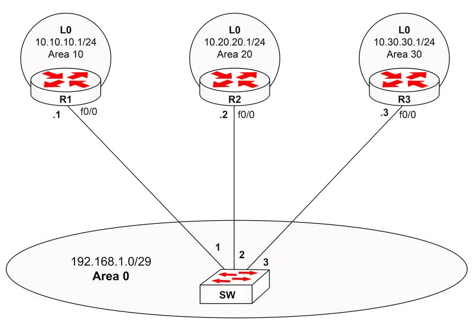

---
tags:
  - OSPF
  - routing
  - dynamic
  - minilab
  - CCNA
---
Temas a tratar: 
- [OSPF](OSPF.md) 
- [OSPF area](OSPF%20area.md) 

El concepto de OSPF multi-area es similar a OSPF single-area (tal como vimos en [OSPF single-area - lab](OSPF%20single-area%20-%20lab.md)). Cuando se configura OSPF multi-area, una de las areas debe ser el area 0 (backbone) y las areas distintas del backbone deben conectarse a este. 

## lab objetives
1. Planear un red usando los principios OSPF de Cisco y establecer los router DR/BDR (si es necesario).
2. Asignar [RID](RID.md)s usando interfaces Loopback o `router id [id address]`. Este paso es opcional pero altamente recomendable.
3. Habilitar OSPF con `router ospf [process ID]` 
4. Configurar las interfaces que quieres que participen en OSPF con `network <ADDRESS> [wildcard] [area #]`.
5. Configurar el soporte de vecinos (si es necesario, p. ej. para NBMA) con `neighbor [ip address]`.
6. Opcionalmente, añadir cualquier tipo de area especial (como NSSA, stub, etc) con `area 1 <OPTIONS>`
7. Opcionalmente, añadir cualquier autenticación, summarization o puesta a punto de Hellos, etc. 

#TODO Debido a confución con el texto y la imagen de referencia, este minilab no se ha completado aun. 