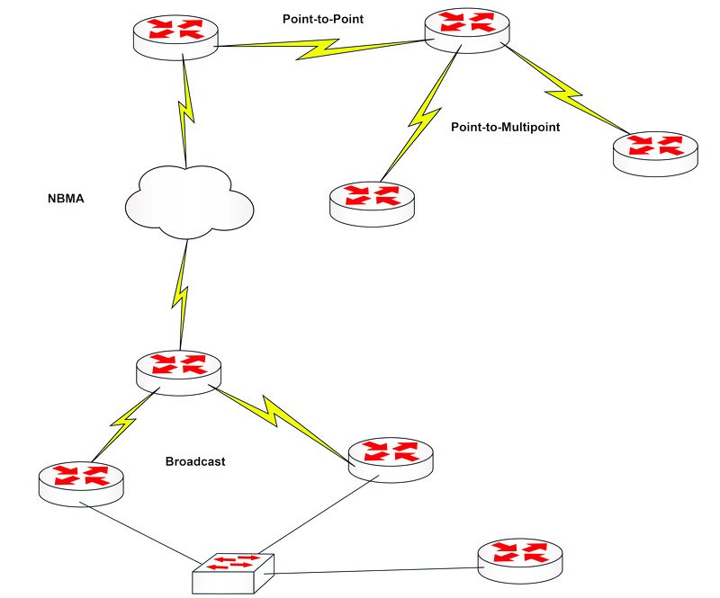

---
tags:
  - routing
  - dynamic
  - OSPF
---

Como se dijo antes, [OSPF](OSPF.md) trata a sus vecinos de diferente forma dependiendo el tipo de enlace que los une. Estos se clasifican en cinco tipos.

- **Point-to-point** - un ejemplo de esto es un enlace simple T1 entre dos routers o una conexión frame relay point-to-point. 
	- _Hellos_ son multicast a `224.0.0.5` (AllSPFRouters)
	- No hay elección DR/DBR en este tipo de red.
- **Broadcast** - p. ej. ethernet, para más precisión nos referimos a este tipo como _Broadcast multi-access network_ porque se puede conectar varios dispositivos para que puedan recibir el mismo paquete. 
	- En este tipo de red se elije un DR/BDR.
	- Los _Hellos_ son multicast en `224.0.0.5`, al igual que todos los paquetes [OSPF](OSPF.md)  originados por el DR/BDR. 
	- Los demás routers hacen actualizaciones multicast y paquetes acknowledgment en `224.0.0.5`, tambien conocidos como _ALLDRouters_. 
- **NBMA** - incluye frame relay o conecciones multipoint.
	- los paquetes multicast no son reenviados a los vecinos porque no hay capacidad de broadcast. 
	- Los vecinos [OSPF](OSPF.md) deben ser configurados por el administrador de red a través del comando `mode on DR/BDR`. 
	- El DR/BDR elegido debe ser un router hub (un router con un circuito con todos lo demás routers). 
- **Point-to-multipoint** - este tipo de red debe ser definido en una red NBMA por el administrador de red.
	- No hay DR/BDR.
	- Los paquetes [OSPF](OSPF.md) son multicast.
	- Se necesita mapear la [IP address](IP%20address.md) remota a la dirección L2 (DLCI para Frame Relay) y añadir la palabra broadcast para que [OSPF](OSPF.md) puede hacer multicast de sus paquetes Hello. 
	``` bash
		interface Serial0/1
		ip address 10.0.0.1 255.255.0.
		encapsulation frame-relay
		ip ospf network point-to-multipoint
		frame-relay map ip 10.0.0.2 20 broadcast
		no frame-relay inverse-arp
	```
- **Virtual links** - estos son usados para enlazar areas que no estan conectadas directamente al Area 0. _Ver: [OSPF virtual links](OSPF%20virtual%20links.md)_.




> Es importante considerar que a diferencia de una red EIGRP (p. ej.), [OSPF](OSPF.md) no es tolerante a topologias de red arbitrarias, esto implica que se debe ser muy cuidadoso al planear la implementación de una red OSPF, esto junto su esquema de [IP address](IP%20address.md) jerárquicos. 
> 
> La topologia de red y el route summarization, la adopción de un entorno de direccionamiento jerarquica y una asignación de direcciones estructurada son lo más importante a la hora de determinar la escalabilidad de su internetwork (Cisco Press). 

