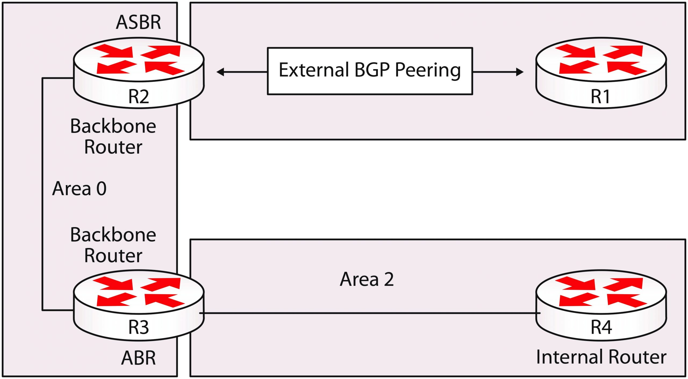

---
tags:
  - routing
  - dynamic
  - OSPF
  - CCNA
---
Algunos de los tipos de routers [OSPF](OSPF.md) más comunes son:
- Area border routers 
- Autonomous system boundary routers 
- Internal routers 
- Backbone routers 

> De esto se hablo en forma resumida en [OSPF explain summary - advanced](OSPF%20explain%20summary%20-%20advanced.md) y en [OSPF terminology](OSPF%20terminology.md). 

En la imagen de abajo vemos una red OSPF basica:
- Podemos ver 2 areas, _OSPF backbone area 0_ y la otra area OSPF normal (2). 
- R2 tiene una relación de vecinos R1 que usa el protocolo external BGP (Border Gateway Protocol), por esto R2 se considera ASBR.

> #exam considerar que BGP no forma parte del temario de la certificación.

El router ABR conecta una o más areas con el area 0 (backbone). Debido a que ABR forma parte de distintas areas, mantiene una DB SPF distinta para cada una de las zonas a las que se conecta, y resume la información _link state_ entre las areas. R3 es ABR porque conecta el area 0 con area 2. 

El router ASBR es el limite del AS ([autonomous system](autonomous%20system.md)). En el contexto [OSPF](OSPF.md), este es cualquier router que injecte rutas desde un origen de rutas diferente dentro de OSPF. Un ruta diferente puede ser otro protocolo de enrutamiento o incluso otro proceso OSPF distinto.  R2 es un ASBR porque tiene interfaces tanto en OSPF como en BGP. 

R4 es un internal router ya que tiene todas sus interfaces dentro de una misma area. 

R2 y R3 son routers backbone (area 0) ya que tiene al menos un interface en el area 0. 