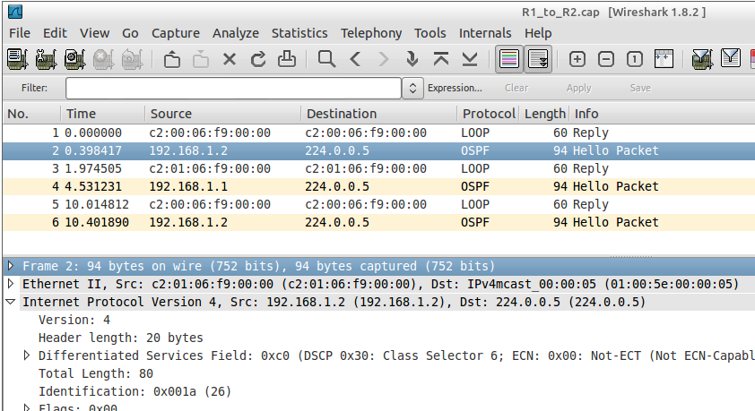
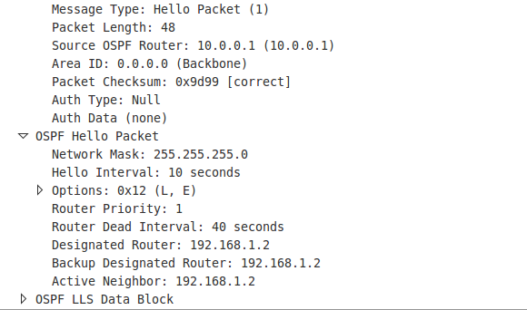

---
tags:
  - routing
  - dynamic
  - OSPF
---

[OSPF](OSPF.md) funciona de diferentes formas dependiendo el tipo de enlace configurado. Por ejemplo puede ser que no haya elección DR/BDR y que los paquetes _Hello_ se envien a una dirección mulcast diferente. 

Cuando se configura [OSPF](OSPF.md) en un router, comienza a enviar paquetes _Hello_ desde todas la interfaces OSPF usando la dirección multicast `224.0.0.5`, esto se conoce como AIISPFRouter address en redes broadcast y point-to-point. En redes NBMA como frame relay, el paquete _Hello_ es unicast a vecinos específicos. 

> OSPF multicast packet

El _OSPF Hello packet_ difiere del _Hello EIGRP_ en que realmente contiene la data que es usada para el intercambio de datos. Esto incluye RID emisor, area ID, mascara de red del emisor, tipo de autenticación, los intervalos _Hello_ y _Dead_ de la interface de origen, DR/BDR, entre otra información. 

Una vez el paquete es verificado, se forma una relación de vecinos, pero no significa que se forma una adyacencia (un virtual link entre routers para enviar rutas). Para eso, estos vecinos deben coincidir en:
- Hello interval 
- Dead interval 
- Area ID
- Password (si es usado)
- Tipo de autenticación 

Cada router envia información de _link state_ a sus vecinos, estos lo registran y lo transmiten a sus otros vecinos. 

Todos los routers deben formar los _link state database_ identicos. Se contruye un camino loop-free hacia cada ruta conocida y el router local es identificado como Root.  
