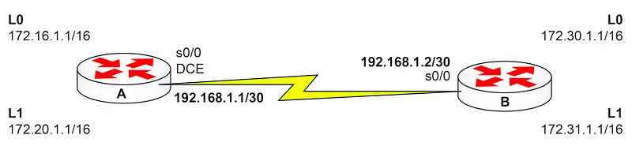

---
tags:
  - routing
  - dynamic
  - OSPF
  - lab
  - CCNA
---

Temas a tratar: 
- [OSPF](OSPF.md) 
- telnet
- authentication

``` bash
# comando relevantes para depuración

show ip ospf database
show ip ospf interface
debug ip ospf packet
```



## lab objetives
1. Use the IP addressing scheme depicted in image. On Router A, you need to configure a clock rate on interface Serial 0/0: set this to 64000.
2. Set Telnet access for the router to use the local login permissions for username banbury and the password ccna.
3. Configure the enable password to be cisco.
4. Configure the OSPF routing protocol to advertise all networks attached to the router.
5. Ensure that the routing information is correct by checking the routing table for entries of the neighbor’s addresses.
6. Finally, try to ping all the neighbor Loopback interfaces, and then try to access the neighbor router via Telnet.

## resolution

 1. Agregar el direccionamiento segun el esquema de la imagen
``` bash
# 1. Agregar el direccionamiento segun el esquema de la imagen

## Router A
Router#config t
Router(config)#hostname RouterA
RouterA(config)#
RouterA(config)#interface Serial0/0
RouterA(config-if)#ip address 192.168.1.1 255.255.255.252
RouterA(config-if)#clock rate 64000 # If this is the DCE side
RouterA(config-if)#no shutdown
RouterA(config-if)#interface Loopback0
RouterA(config-if)#ip address 172.16.1.1 255.255.0.0
RouterA(config-if)#interface Loopback1
RouterA(config-if)#ip address 172.20.1.1 255.255.0.0
RouterA(config-if)#^Z
RouterA#

## Router B:
Router#config t
Router(config)#hostname RouterB
RouterB(config)#
RouterB(config)#interface Serial0/0
RouterB(config-if)#ip address 192.168.1.2 255.255.255.252
RouterB(config-if)#no shutdown
RouterB(config-if)#interface Loopback0
RouterB(config-if)#ip address 172.30.1.1 255.255.0.0
RouterB(config-if)#interface Loopback1
RouterB(config-if)#ip address 172.31.1.1 255.255.0.0
RouterB(config-if)#^Z
RouterB#

# clock rate en s0/0
RouterA(config-if)#clock rate 64000 
```

2. Acceso telnet, necesitamos configurar la VTY lines para permitir el acceso telnet. 

``` bash
# Router A
RouterA(config)#line vty 0 4 # Enters the VTY line configuration
RouterA(config-line)#login local # This will use local usernames and passwords for Telnet access
RouterA(config-line)#exit # Exits the VTY config mode
RouterA(config)#username banbury password ccna # Creates username and password for Telnet access (login local)

# Router B:
RouterB(config)#line vty 0 4
RouterB(config-line)#login local
RouterB(config-line)#exit
RouterB(config)#username banbury password ccna
```

3. Habilitar la contraseña `cisco`

``` bash
RouterA(config)#enable secret cisco # Sets the enable password (encrypted)

RouterB(config)#enable secret cisco
```

4. Configurar OSPF para anunciar a todas la redes adjuntas al router.

``` bash
# Router A
RouterA(config)#router ospf 20 # Enables the OSPF routing process
RouterA(config-router)#network 172.20.0.0 0.0.255.255 area 0
RouterA(config-router)#network 192.168.1.0 0.0.0.3 area 0
RouterA(config-router)#network 172.16.0.0 0.0.255.255 area 0
## Specifies the networks for OSPF to advertise; one network statement is needed for every network advertised.

# Router B:
RouterB(config)#router ospf 20
RouterB(config-router)#network 192.168.1.0 0.0.0.3 area 0
RouterB(config-router)#network 172.30.0.0 0.0.255.255 area 0
RouterB(config-router)#network 172.31.0.0 0.0.255.255 area 0
```

6. Comprobar que la información de routing es correcta comprobando la tabla de enrutamiento del vecino. 

Podemos usar `show ip route` para determinar si las redes anunciadas por el proceso OSPF del vecino estan en la tabla de enrutamiento. 

``` bash
RouterA#show ip route
Codes: C - connected, S - static, I - IGRP, R - RIP,
M - mobile, B – BGP, D - EIGRP, EX - EIGRP external,
O – OSPF, IA - OSPF inter area,
N1 - OSPF NSSA external type 1,
N2 - OSPF NSSA external type 2,
E1 - OSPF external type 1, E2 - OSPF external type 2,
E – EGP, i - IS-IS, L1 - IS-IS level-1,
L2 - IS-IS level-2, ia - IS-IS interarea,
* - candidate default, U - per-user static route,
o – ODR, P - periodic downloaded static route
Gateway of last resort is not set
C 172.16.0.0/16 is directly connected, Loopback0
C 172.20.0.0/16 is directly connected, Loopback1
172.31.0.0/32 is subnetted, 1 subnets
O 172.31.1.1 [110/65] via 192.168.1.2, 00:01:33, Serial0/0
172.30.0.0/32 is subnetted, 1 subnets
O 172.30.1.1 [110/65] via 192.168.1.2, 00:01:33, Serial0/0
192.168.1.0/30 is subnetted, 1 subnets
C 192.168.1.0 is directly connected, Serial0
RouterA#
```

Vemos la configuración de OSPF con `show ip protocols`.

``` bash
RouterA#show ip protocols
Routing Protocol is ospf 20
Outgoing update filter list for all interfaces is not set
Incoming update filter list for all interfaces is not set
Router ID 172.20.1.1
Maximum path: 4
Routing for Networks:
172.16.0.0 0.0.255.255 area 0
Technet24.ir
172.20.0.0 0.0.255.255 area 0
192.168.1.0 0.0.0.3 area 0
Routing Information Sources:
Gateway Distance Last Update
172.31.1.1 110 00:05:48
172.20.1.1 110 00:05:48
Distance: (default is 110)
```

7. Probamos la conectividad de los vecinos Loopback e ingresamos al router via telnet. 

``` bash
RouterA#ping 172.30.1.1 # This will send a ping packet to the address
specified; there should be five replies if everything is OK.
Type escape sequence to abort.
Sending 5, 100-byte ICMP Echos to 172.30.1.1, timeout is 2 seconds:
!!!!!
Success rate is 100 percent (5/5), round-trip min/avg/max = 28/31/32 ms
RouterA#
RouterA#telnet 172.31.1.1 # This will open a Telnet connection to the neighbor’s router. If Telnet access has been set up correctly you will be presented with a login message.
RouterA#telnet 172.31.1.1
Trying 172.31.1.1 ... Open
User Access Verification
Username: banbury
Password:
RouterB>exit
[Connection to 172.31.1.1 closed by foreign host]
RouterA#
RouterA#show ip ospf neighbor
Neighbor ID Pri State Dead Time Address Interface
172.31.1.1 1 FULL/ - 00:00:29 192.168.1.2 Serial0
```

### show runs 
Este apartado sirve para ver la configuración final de cada uno de los routers 

``` bash
# router A

RouterA#show run
Building configuration...
!
version 15.1
!
hostname RouterA
!
enable secret 5 $1$rujI$BJ8GgiK8U9p5cdfXyApPr/
!
username banbury password 0 ccna
!
interface Loopback0
ip address 172.16.1.1 255.255.0.0
!
interface Loopback1
ip address 172.20.1.1 255.255.0.0
!
interface Serial0/0
ip address 192.168.1.1 255.255.255.252
clockrate 64000
!
router ospf 20
log-adjacency-changes
network 172.16.0.0 0.0.255.255 area 0
network 172.20.0.0 0.0.255.255 area 0
network 192.168.1.0 0.0.0.3 area 0
!
ip classless
no ip http server
!
line con 0
password letmein
login
Technet24.ir
line aux 0
line vty 0 4
login local
!
end

---

# router B

RouterB#show run
Building configuration...
Current configuration : 853 bytes
!
version 15.1
!
hostname RouterB
!
enable secret 5 $1$ydeA$MyfRKevOckjm7w/0ornnB1
!
username banbury password 0 ccna
!
interface Loopback0
ip address 172.30.1.1 255.255.0.0
!
interface Loopback1
ip address 172.31.1.1 255.255.0.0
!
interface Serial0/0
ip address 192.168.1.2 255.255.255.252
!
router ospf 20
log-adjacency-changes
network 172.30.0.0 0.0.255.255 area 0
network 172.31.0.0 0.0.255.255 area 0
network 192.168.1.0 0.0.0.3 area 0
!
ip classless
no ip http server
!
line con 0
password letmein
login
line aux 0
line vty 0 4
login local
!
end
```