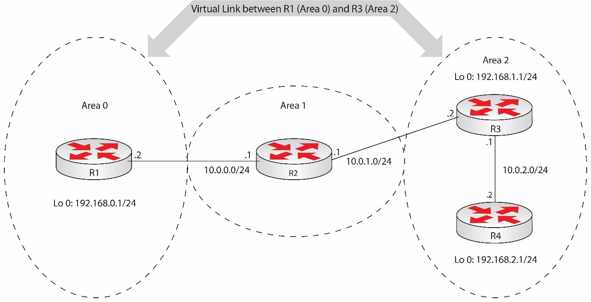

---
tags:
  - routing
  - dynamic
  - OSPF
---

Los virtual link son usados para extender el Area 0 a través de otras areas y cumplen la regla que todas las areas non-zero deben conectarse directamente al Area 0 (backbone). Un virtual link es usado para LSAs tunneling en un area non-zero. 

Estos se basan en IDs de routers fijos porque el valor de RID es usado en la configuración del virtual link.

> Cisco advierte que el uso de virtual links indica un mal diseño de la red [OSPF](OSPF.md) 