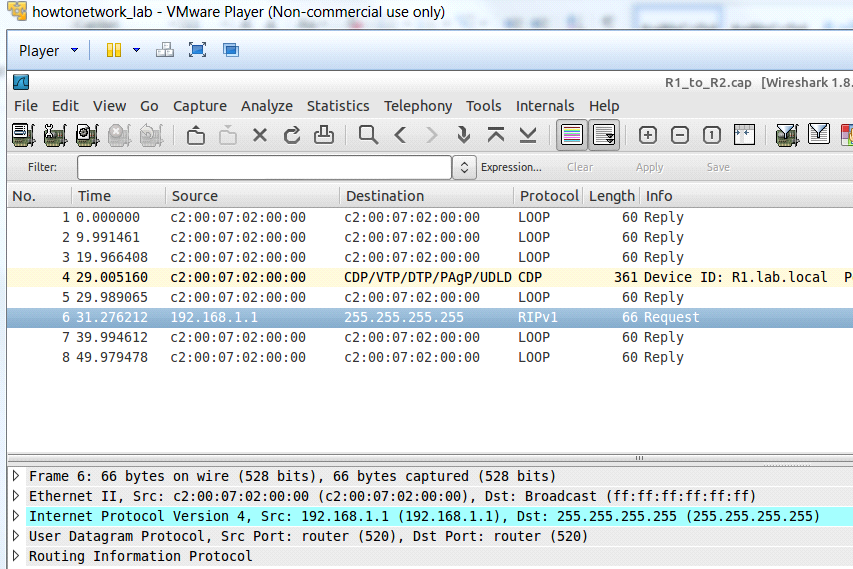

---
tags:
  - routing
  - dynamic
  - RIP
  - example
---

A small network running [RIP](RIP.md) 

``` bash
R1#show ip route
Gateway of last resort is not set
C    172.16.0.0/16 is directly connected, Serial0/0
C    192.168.5.0/24 is directly connected, Serial0/1
R    10.0.0.0/8 [120/1] via 192.168.5.2, 00:00:26, Serial0/1
[120/1] via 172.16.1.2, 00:00:11, Serial0/0
R    192.168.1.0/24 [120/1] via 192.168.5.2, 00:00:26, Serial0/1
R    192.168.2.0/24 [120/2] via 192.168.5.2, 00:00:00, Serial0/1

```


In the output below, it is clear that version 1 of RIP is in use because the send version is set to 1:
```
R1#show ip protocols
Routing Protocol is “rip”
Outgoing update filter list for all interfaces is not set
Incoming update filter list for all interfaces is not set
**Sending updates every 30 seconds, next due in 26 seconds**
**Invalid after 180 seconds, holddown 180, flushed after 240**
Redistributing: rip
Default version control: send version 1, receive any version
Interface             **Send**  Recv  Triggered RIP  Key-chain
Serial0/0             **1**     1 2
Serial0/1             **1**     1 2
Automatic network summarization is in effect
Maximum path: 4
Routing for Networks:
172.16.0.0
192.168.5.0
Routing Information Sources:
Gateway         Distance      Last Update
192.168.5.2     120           00:00:27
172.16.1.2      120           00:00:21
Distance: (default is 120)
```

In the screenshot below, RIP uses broadcasts (with the destination field “255.255.255.255”). Note also that it uses UDP port 520 (for the source and destination).

