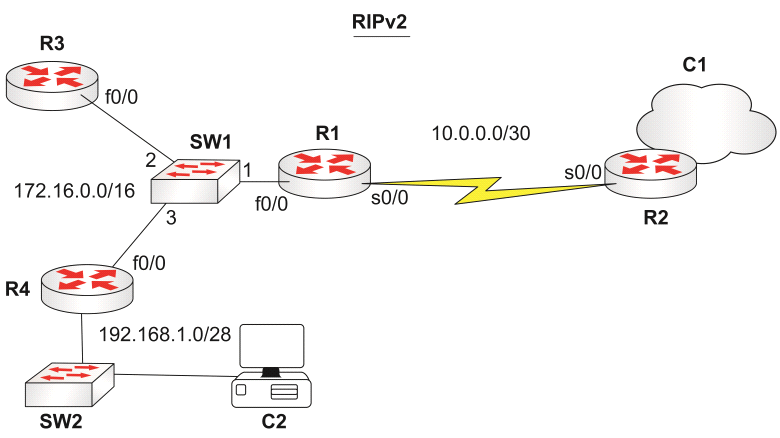

Temas a tratar:
- [RIP](RIP.md) 
- [RIPv2](RIPv2.md) 
- [default routes for RIPv2](default%20routes%20for%20RIPv2.md) 
- [gateway of last resort](gateway%20of%20last%20resort.md) 
- [passive interface in RIP](passive%20interface%20in%20RIP.md) 



## lab objetives 
- Configure the network above, including all IP addresses.
- Use show commands to establish any issues present.
- Use show commands to establish any issues present.
- Use show commands to establish any issues present.
- Make the LAN interface on R4 passive.

## resolution

``` bash
# 1. configurar las red, incluyendo direcciones IP

## R1
_R1#configure terminal_
_R1(config)#interface FastEthernet0/0_
_R1(config)#ip address 172.16.0.1 255.255.0.0_
_R1(config)#interface Serial0/0_
_R1(config)#ip address 10.0.0.1 255.255.255.252_
_R1(config-if)#no shut_
_R1(config-if)#^Z_

## R2:
_R2#configure terminal_
_R2(config)#interface Serial0/0_
_R2(config)#ip address 10.0.0.2 255.255.255.252_
_R2(config-if)#no shut_
_R2(config-if)#^Z_

## R3:
_R3#configure terminal_
_R3(config)#interface f0/0_
_R3(config)#ip address 172.16.0.2 255.255.0.0_
_R3(config-if)#no shut_
_R3(config-if)#^Z_

## R4:
_R4#configure terminal_
_R4(config)#interface f0/0_
_R4(config)#ip address 172.16.0.3 255.255.0.0_
_R4(config-if)#no shut_
_R4(config)#interface f0/1_
_R4(config)#ip address 192.168.1.1. 255.255.255.240_
_R4(config-if)#no shut_
_R4(config-if)#^Z
```

Realizamos `ping` entre algunos de los routers para comprobar que las interfaces esten _up_ y esten las direcciones bien configuradas.

``` bash
_R4#ping 172.16.0.1_
_Type escape sequence to abort._
_Sending 5, 100-byte ICMP Echos to 172.16.0.1, timeout is 2 seconds:_
_.!!!!_
```


``` bash
# 2. To configure routers with RIPv2, enter the following commands:

_R1#configure terminal_
_R1(config)#router rip_
_R1(config-router)#version 2_
_R1(config-router)#network 10.0.0.0_
_R1(config-router)#network 172.16.0.0_

_R2#configure terminal_
_R2(config)#router rip_
_R2(config-router)#version 2_
_R2(config-router)#network 10.0.0.0_

_R3#configure terminal_
_R3(config)#router rip_
_R3(config-router)#version 2_
_R3(config-router)#network 172.16.0.0_

_R4#configure terminal_
_R4(config)#router rip_
_R4(config-router)#version 2_
_R4(config-router)#network 172.16.0.0_
_R4(config-router)#network 192.168.1.0_
```

``` bash
# 3. Revisamos las tablas de enrutamiento, deberiamos esperar tener auto summarization con submask por defecto. 

_R2#show ip route_
_Gateway of last resort is not set_
_R    172.16.0.0/16 [120/1] via 10.0.0.1, 00:00:22, Serial0/0_
_10.0.0.0/30 is subnetted, 1 subnets_
_C       10.0.0.0 is directly connected, Serial0/0_
_R    **192.168.1.0/24** [120/2] via 10.0.0.1, 00:00:10, Serial0/0_
```

``` bash
# 4. Para ver /28 en R2, aplicamos la no auto-sumarización en todos los routers de la red.

_R4(config-router)#no auto-summary_
```

``` bash
# 5. Revisamos la tabla de enrutamiento nuevamente en R2, borramos la tabla de enrutamiento en caso de que no se actualize la submask 

_R2#clear ip route *_
_R2#show ip route_
_Gateway of last resort is not set_
_R    172.16.0.0/16 [120/1] via 10.0.0.1, 00:00:04, Serial0/0_
_10.0.0.0/30 is subnetted, 1 subnets_
_C       10.0.0.0 is directly connected, Serial0/0_
_192.168.1.0/24 is variably subnetted, 2 subnets, 2 masks_
_R       **192.168.1.0/28** [120/2] via 10.0.0.1, 00:00:04, Serial0/0_
_R       192.168.1.0/24 [120/2] via 10.0.0.1, 00:00:04, Serial0/0_
```

``` bash
# 6. Ahora inyectamos una default route en la red RIP, configuramos solo un router para que los demás reciban la ruta y la utilizen como gateway of last resort.

_R4#show ip route_
_**Gateway of last resort is not set**_
_C    172.16.0.0/16 is directly connected, FastEthernet0/0_
_10.0.0.0/30 is subnetted, 1 subnets_
_R       10.0.0.0 [120/1] via 172.16.0.1, 00:00:15, FastEthernet0/0_
_192.168.1.0/28 is subnetted, 1 subnets_
_C       192.168.1.0 is directly connected, FastEthernet0/1_

_R1(config)#ip route 0.0.0.0 0.0.0.0 10.0.0.2_
_R1(config)#router rip_
_R1(config-router)#default-information originate_

_R4#show ip route_
_**Gateway of last resort is 172.16.0.1 to network 0.0.0.0**_
_C    172.16.0.0/16 is directly connected, FastEthernet0/0_
_10.0.0.0/30 is subnetted, 1 subnets_
_R       10.0.0.0 [120/1] via 172.16.0.1, 00:00:21, FastEthernet0/0_
_192.168.1.0/28 is subnetted, 1 subnets_
_C       192.168.1.0 is directly connected, FastEthernet0/1_
_**R*   0.0.0.0/0 [120/1] via 172.16.0.1, 00:00:21, FastEthernet0/0**_
```

``` bash
# 7. No hay necesidad de enviar updates RIP en la LAN de R4, asi que lo convertimos en una interface pasiva

_R4(config)#router rip_
_R4(config-router)#passive-interface f0/1_
_R4(config-router)#end_
_R4#show ip protocols_
_Routing Protocol is “rip”_
_Outgoing update filter list for all interfaces is not set_
_Incoming update filter list for all interfaces is not set_
_Sending updates every 30 seconds, next due in 20 seconds_
_Invalid after 180 seconds, holddown 180, flushed after 240_
_Redistributing: rip_
_Default version control: send version 2, receive version 2_
_Interface             Send  Recv  Triggered RIP  Key-chain_
_FastEthernet0/0       2     2_
_Automatic network summarization is not in effect_
_Maximum path: 4_
_Routing for Networks:_
_172.16.0.0_
_192.168.1.0_
_**Passive Interface(s):**_
    _**FastEthernet0/1**_
_Routing Information Sources:_
_Gateway         Distance      Last Update_
_172.16.0.1      120           00:00:17_
_Distance: (default is 120)_
```

Por ultimo revisamos las configuraciones de los routers con `show running-config`, para tener una referencia de como deberia quedar al finalizar el lab.

``` bash
# R1

_hostname R1_

_!_

_interface FastEthernet0/0_

_ip address 172.16.0.1 255.255.0.0_

_duplex auto_

_speed auto_

_!_

_interface Serial0/0_

_ip address 10.0.0.1 255.255.255.252_

_clock rate 2000000_

_!_

_router rip_

_version 2_

_network 10.0.0.0_

_network 172.16.0.0_

_default-information originate_

_no auto-summary_

_!_

_ip route 0.0.0.0 0.0.0.0 10.0.0.2_

_– – –_

# R2

_hostname R2_

_!_

_interface Serial0/0_

_ip address 10.0.0.2 255.255.255.252_

_clock rate 2000000_

_!_

_router rip_

_version 2_

_network 10.0.0.0_

_– – –_

# R3

_hostname R3_

_!_

_interface FastEthernet0/0_

_ip address 172.16.0.2 255.255.0.0_

_duplex auto_

_speed auto_

_!_

_interface FastEthernet0/1_

_no ip address_

_shutdown_

_duplex auto_

_speed auto_

_!_

_router rip_

_version 2_

_network 172.16.0.0_

_– – –_

# R4

_hostname R4_

_!_

_interface FastEthernet0/0_

_ip address 172.16.0.3 255.255.0.0_

_duplex auto_

_speed auto_

_!_

_interface FastEthernet0/1_

_ip address 192.168.1.1 255.255.255.240_

_duplex auto_

_speed auto_

_!_

_router rip_

_version 2_

_passive-interface FastEthernet0/1_

_network 172.16.0.0_

_network 192.168.1.0_

_no auto-summary_
```