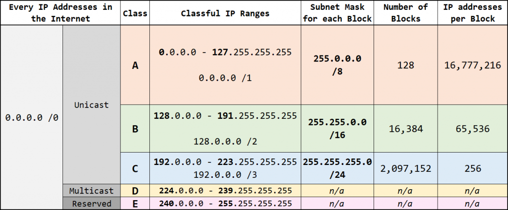

---
tags:
  - routing
  - CCNA
---

El direccionamiento [classful]() se hizo en la etapas tempranas de internet, se trata del asignamiento IP en base a octetos.

Cuando una empresa necesitaba cierta cantidad de IPs, debia ver la tabla [classful]() para ver en que clase deberia estar (dependiendo de la cantidad que necesite, mayor a igual a la clase). 

Esto resulta ser ineficiente porque, p. ej. en el caso que necesitemos 300 IPs, no podemos tomar la clase C (al tener un maximo de 256 IP), entonces tenemos que ir por la clase B que tiene 65.536! para solo 300 IPs. 

Es por esto que despues se desarrollaron metodos  de direccionamiento [classless](classless.md) como [CIDR](CIDR.md).  
