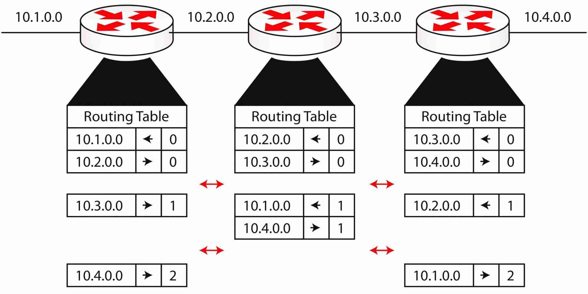
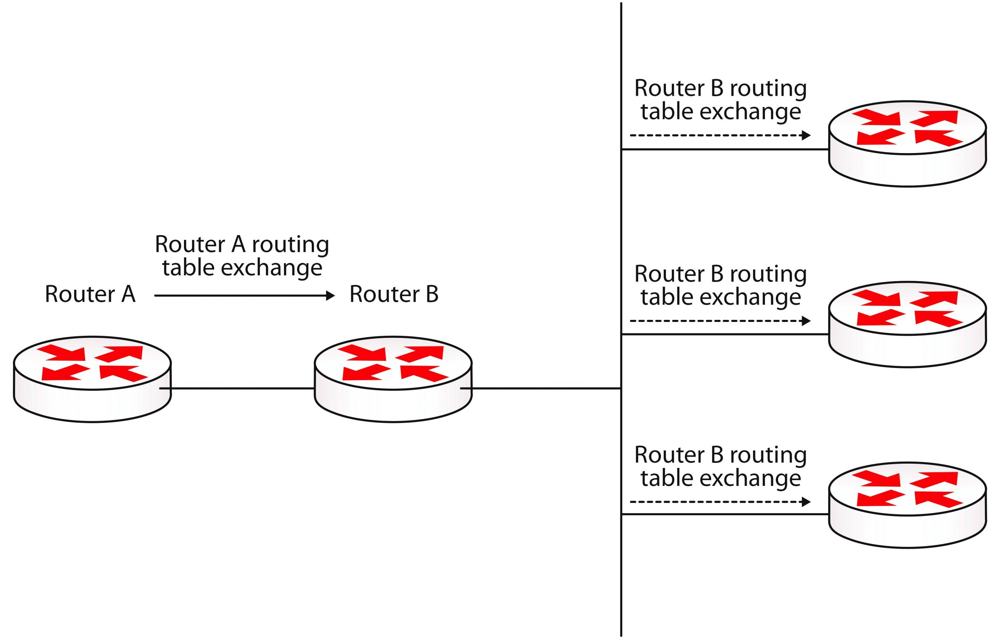

---
tags:
  - routing
  - dynamic
  - CCNA
---

Tambien lo puede encontrar como _Bellman-Ford algorithms_. Son algoritmos usados para calcular el mejor camino para llegar a las rutas definidas por otros routers, despues actualizan sus tablas de routing con esa información, esto permite que las rutas sean cambiantes en la topologia de red. 
Con distancia se refiere a la medición usada para calcular la distancia de la ruta en la tabla, el vector es la dirección que debe tomar el tráfico hacia la ruta. 

## routers exchange routing tables
Distance vector routing es una propiedad de algunos protocolos de routing que hacen una 'imagen' interna de la topologia de red que intercambia periodicamente sus routing tables y [metrics](metrics.md) entre dispositivos vecinos. 
Cuando la red converge por 1ra vez, los routers primero descubren las redes adjuntas antes de intercambiar sus routing tables. 

## routing table exchange 
La principal diferencia entre los protocolos _distance vector routing_  y _link state protocols_ es el camino para intercambiar la actualizaciones de routing.
- Distance vector protocols usa la tecnicá _routing-by-rumor_, esto implica que cada router es dependiente de sus vecinos en tener una correcta información sobre la routing table. Cada router envia periodicamente su routing table a sus vecinos, el intervalo depende de cada protocolo. Si ejecuta`show ip protocols` podra ver que RIP envia actualizaciones cada 30 segs, en una gran red empresarial esto puede suponer un problema.

## distance vector routing protocol behavior
La ventaja más importante de _distance vector routing protocols_ es la facilidad de implementación y mantenimiento. La desventaja es que tiene tiempos de convergencia lentos. 
- Una red convergente es una red en la que cada router tiene la misma perspectiva de la topologia 
Cuando hay cambios en la topologia, los routers de esa zona envian esa información al resto de la red, en forma de _hop-by-hop basis_ (salto a salto en cada router). Entonces, la convergencia no ocurrira hasta que todos los routers hayan recibido la información del cambio. 

Otra desventaja relacionada es que _distance vector routing protocols_ es que consume bastante ancho de banda (sobretodo en grandes redes). Por ende, estos protocolos solo se recomiendan en implementaciones de redes relativamente pequeñas. 

Un ejemplo de un protocolo _distance vector routing_ es [RIPv2](RIPv2.md), en el cual podemos ver otra desventaja: el hecho de que envie información de routing cada 30 segs, en redes estables (sin cambios apenas) esto es innecesario y desperdicia ancho de banda.

Si un router que utiliza algun _distance vector protocol_ tiene información inexacta, esta información se propagara por toda la red pudiendo causar grandes daños, p. ej. bucles de enrutamiento. 