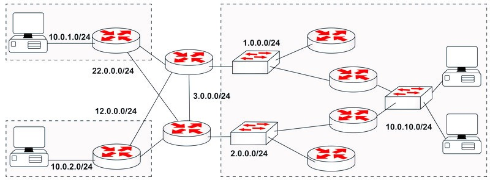

En terminos simples, el routing dinamico hace uso de un protocolo de routing para descubrir redes alcanzables y poder definir las mejores rutas para poder llegar hacia ellas. 

El routing dinamico nos facilita la adminstración de redes, sobrotodo con redes medias o grandes. El routing estatico sin embargo sigue siendo util para cuestiones excepcionales o para redes más pequeñas. 

Los protocolos de routing dinamico se dividen en dos tipos:
- [distance vector protocol](distance%20vector%20protocol.md) 
- [link state protocol](link%20state%20protocol.md) 

Ambos hacen el mismo trabajo pero por diferentes vias, un hibrido de ambos es EIGRP por ejemplo. Algunas de las funciones de estos protocolos son:
- Anunciar redes conectadas
- Aprender nuevas redes 
- Saber lidiar con rutas defectuosas o inhabilitadas
- Determinar el mejor camino sin loops para el trafico

