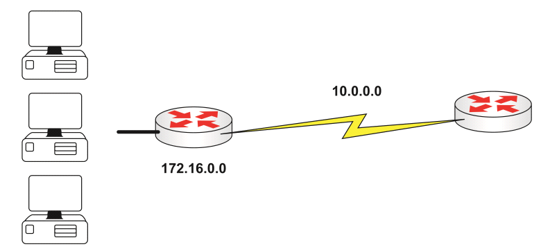

---
tags:
  - routing
  - dynamic
  - RIP
---

_Ver: [passive interface](passive%20interface.md)_ 

En [RIP](RIP.md), una interface pasiva recibira actualizaciones de enrutamiento pero no enviará ninguna. 

Si se trata de un gran número de interfaces para agregar, se puede usar el `default` para hacer pasivas todas las interfaces.

``` bash
R1(config-router)#passive-interface ?
FastEthernet       IEEE 802.3
default            Suppress routing updates on all interfaces
[output truncated]
```



En este imagen podemos ver que el multicast [RIP](RIP.md) esta anulado por la LAN. La red `172` se difunde a través del enlace serial, la interfaz LAN es [passive interface](passive%20interface.md) en este caso. 

``` bash
R1(config-if)#router rip
R1(config-router)#net 10.0.0.0
R1(config-router)#net 172.16.0.0
R1(config-router)#passive-interface f0/0
```

El comando `show ip protocols` nos indicará que interfaces son [passive interface](passive%20interface.md). 

``` bash
R1#show ip protocols
Routing Protocol is “rip”
Invalid after 180 seconds, holddown 180, flushed after 240
Redistributing: rip
Default version control: send version 1, receive any version
Interface             Send  Recv  Triggered RIP  Key-chain
Loopback0             1     1 2
Automatic network summarization is in effect
Maximum path: 4
Routing for Networks:
10.0.0.0
172.16.0.0
Passive Interface(s):
    FastEthernet0/0
[output truncated]
```