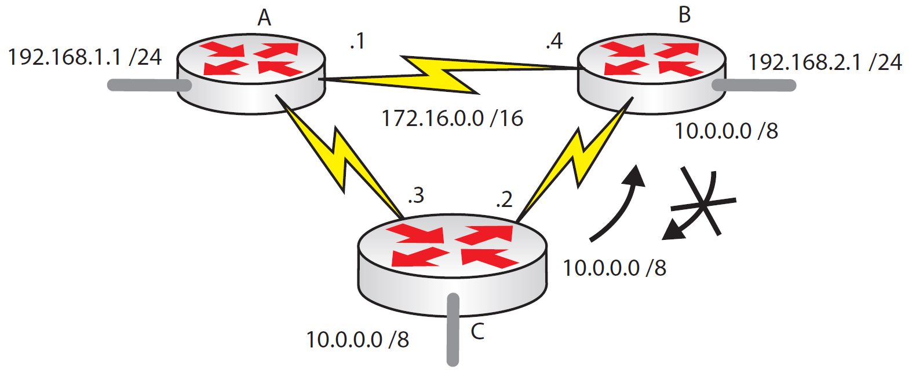

---
tags:
  - routing
  - dynamic
  - RIP
  - CCNA
---

Un router recibe una ruta (proveniente de un anuncio de otro router) automáticamente dentro de la routing table. Entonces, este router anuncia a través de sus interfaces las rutas del que dispone para que los demás routers tenga conocimiento de su tabla. 

> split horizon prevents sending a route out of the interface it was learned on

Un problema que ocurre es cuando la ruta es anunciada desde la misma interface desde la que el router aprendió la ruta, esto produce confusión para saber donde esta realmente la red. 

Router C le dice a router B que puede llegar a `10.0.0.0/8` a través del enlace serial. Router B normalmente enviaría esta información en cada una de sus interfaces, pero esto causaría confusión porque router C es donde esta la red conectada directamente. Split horizon (regla de horizonte) previene esto haciendo que la información de las rutas sea unidireccional, es decir, una vez que un router haya enviado información a otro por la interface, el router receptor no volverá a enviar la información por esa interface. Esto previene la posibilidad de routing loops.