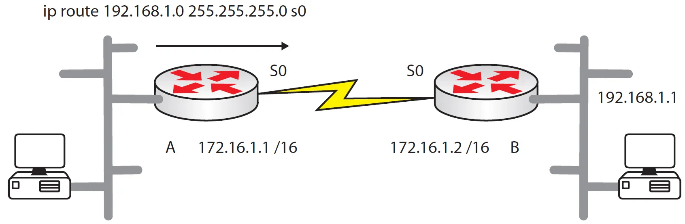

# static route configuration

``` bash
RouterA(config)$ ip route [network prefix_mask] [address | interface] [distance]

- network – the destination network
- prefix_mask – the subnet mask for that network
- address – the IP address of the next-hop router
- interface – the interface by which the traffic leaves
- distance – (optional) the administrative distance of the route; this is an indicator of the validity of the routing protocol (source of the route), and lower distances are always preferred
```

Recordar que si se usa una next-hop [IP Address](../../NetWarriors/IP%20Address.md) para configurar una ruta estática, esta dirección debe ser alcanzable (reachable). También es necesario añadir una [IP Address](../../NetWarriors/IP%20Address.md) a la interface de salida. 



``` bash
RouterA(config)$ ip route 192.168.1.0 255.255.255.0 172.16.1.2 110



# static route configuration

``` bash
RouterA(config)$ ip route [network prefix_mask] [address | interface] [distance]

- network – the destination network
- prefix_mask – the subnet mask for that network
- address – the IP address of the next-hop router
- interface – the interface by which the traffic leaves
- distance – (optional) the administrative distance of the route; this is an indicator of the validity of the routing protocol (source of the route), and lower distances are always preferred
```

Recordar que si se usa una next-hop [IP Address](../../NetWarriors/IP%20Address.md) para configurar una ruta estática, esta dirección debe ser alcanzable (reachable). También es necesario añadir una [IP Address](../../NetWarriors/IP%20Address.md) a la interface de salida. 


``` bash
RouterA(config)$ ip route 192.168.1.0 255.255.255.0 172.16.1.2 110



# static route configuration

``` bash
RouterA(config)$ ip route [network prefix_mask] [address | interface] [distance]

- network – the destination network
- prefix_mask – the subnet mask for that network
- address – the IP address of the next-hop router
- interface – the interface by which the traffic leaves
- distance – (optional) the administrative distance of the route; this is an indicator of the validity of the routing protocol (source of the route), and lower distances are always preferred
```

Recordar que si se usa una next-hop [IP Address](../../NetWarriors/IP%20Address.md) para configurar una ruta estática, esta dirección debe ser alcanzable (reachable). También es necesario añadir una [IP Address](../../NetWarriors/IP%20Address.md) a la interface de salida. 


``` bash
RouterA(config)$ ip route 192.168.1.0 255.255.255.0 172.16.1.2 110



# static route configuration

``` bash
RouterA(config)$ ip route [network prefix_mask] [address | interface] [distance]

- network – the destination network
- prefix_mask – the subnet mask for that network
- address – the IP address of the next-hop router
- interface – the interface by which the traffic leaves
- distance – (optional) the administrative distance of the route; this is an indicator of the validity of the routing protocol (source of the route), and lower distances are always preferred
```

Recordar que si se usa una next-hop [IP Address](../../NetWarriors/IP%20Address.md) para configurar una ruta estática, esta dirección debe ser alcanzable (reachable). También es necesario añadir una [IP Address](../../NetWarriors/IP%20Address.md) a la interface de salida. 


``` bash
RouterA(config)$ ip route 192.168.1.0 255.255.255.0 172.16.1.2 110

192.168.1.0 : red de destination 
255.255.255.0 : subnet mask
172.16.1.2 : next-hop IP address
110: AD (administrative distance) 

Alternativa especificando la interface 
RouterA(config)$ ip route 192.168.1.0 255.255.255.0 Serial0

Una ruta especificada por un interface tiene un AD de 0
 ```

> Es esencial que el next-hop IP addrees pueda ser conocido por el router, caso contrario. La ruta asignada no  sera agregada a la tabla de enrutamiento
> Otra cuestión es que la comunicación es bidireccional, es decir, ambos lados deben conocer tanto el origen como el destino de un paquete.  

Se puede enviar un interface junto a la interface de salida para evitar constantes mensajes broadcast ARP en el segmento.
``` bash
RouterA(config)$ ip route 192.168.1.0 255.255.255.0 Serial0 172.16.1.2
```