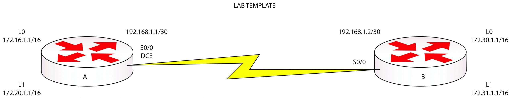

---
tags:
  - routing
  - static
  - lab
---




## Lab objetives


## Resolution

### Router A
``` bash
# Set ip addresses on an interface

Router#config t
Router(config)#hostname RouterA
RouterA(config)#interface Serial0/0
RouterA(config-if)#ip address 192.168.1.1 255.255.255.252
RouterA(config-if)#clock rate 64000
RouterA(config-if)#no shutdown
RouterA(config-if)#interface Loopback0
RouterA(config-if)#ip address 172.16.1.1 255.255.0.0
RouterA(config-if)#interface Loopback1
RouterA(config-if)#ip address 172.20.1.1 255.255.0.0
```

``` bash
# set clock rate
RouterA(config-if)#int S0/0
RouterA(config-if)#clock rate 64000
```

``` bash
# telnet access

RouterA(config)#line vty 0 4       Enters the VTY line configuration
RouterA(config-line)#login local   This will use local
  **usernames and passwords for Telnet access**
RouterA(config-line)#exit 
RouterA(config)#username pepe password ccna
```

``` bash
# enable password 

RouterA(config)#enable secret cisco
```

``` bash
# configure static routes in the router 

RouterA(config)#ip route 172.30.0.0 255.255.0.0 192.168.1.2
RouterA(config)#ip route 172.31.0.0 255.255.0.0 192.168.1.2
```

El comando anterior configura dos rutas estáticas para llegar hacia las redes `172.30.0.0` y `172.31.0.0` usando el next-hop address `192.168.1.2`. Tambien podrias hacerlo pero esta vez usando las interfaces de salida (puedes usar uno o lo otro, no los dos a la vez). 

``` bash
RouterA(config)#ip route 172.30.0.0 255.255.0.0 Serial0/0
RouterA(config)#ip route 172.31.0.0 255.255.0.0 Serial0/0
```

### Router B 
``` bash
# set ip address 

Router#config t
Router(config)#hostname RouterB
RouterB(config)#interface Serial0/0
RouterB(config-if)#ip address 192.168.1.2 255.255.255.252
RouterB(config-if)#no shutdown
RouterB(config-if)#interface Loopback0
RouterB(config-if)#ip address 172.30.1.1 255.255.0.0
RouterB(config-if)#interface Loopback1
RouterB(config-if)#ip address 172.31.1.1 255.255.0.0
```

Ahora podemos probar desde router A hacer ping a través del enlace serial.
``` bash
RouterA#ping 192.168.1.2
Type escape sequence to abort.
Sending 5, 100-byte ICMP Echos to 192.168.1.2, timeout is 2 seconds:
!!!!!
Success rate is 100 percent (5/5), round-trip min/avg/max = 28/31/32 ms
```

``` bash
# configure telnet access and enable password 

RouterB(config)#line vty 0 4
RouterB(config-line)#login local
RouterB(config-line)#exit
RouterB(config)#username pepe password ccna
Configure the enable secret password:
RouterB(config)#enable secret cisco
```

```bash
# set static route 

RouterB(config)#ip route 172.16.0.0 255.255.0.0 192.168.1.1
RouterB(config)#ip route 172.20.0.0 255.255.0.0 192.168.1.1

# remember that the output interface can be used as well.
```

``` bash
# Use the show ip route command to check that the static routes are in the routing table

RouterA#show ip route
Codes: C – connected, S – static, I – IGRP, R – RIP,
M – mobile, B – BGP, D – EIGRP, EX – EIGRP external,
O – OSPF, IA – OSPF inter area,
N1 – OSPF NSSA external type 1,
N2 – OSPF NSSA external type 2,
E1 – OSPF external type 1, E2 – OSPF external type 2,
E – EGP, i – IS-IS, L1 – IS-IS level-1,
L2 – IS-IS level-2, ia – IS-IS inter area,
* – candidate default, U – per-user static route,
o – ODR, P – periodic downloaded static route
Gateway of last resort is not set
C    172.16.0.0/16 is directly connected, Loopback0
C    172.20.0.0/16 is directly connected, Loopback1
**S    172.31.0.0/16 [1/0] via 192.168.1.2**
**S    172.30.0.0/16 [1/0] via 192.168.1.2**
192.168.1.0/30 is subnetted, 1 subnets
C    192.168.1.0 is directly connected, Serial0/0
```

A partir de aca podemos ir probando con `ping` cada interface para verificar la conectividad.