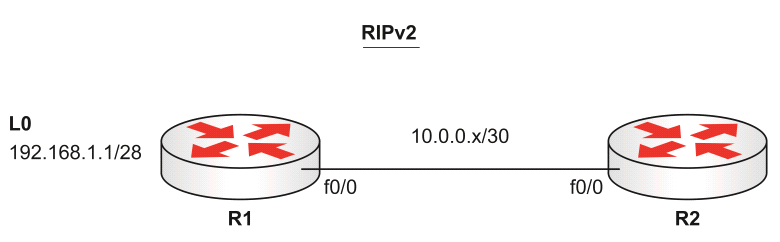

Vamos a configurar estos dos routers para que trabajen bajo [RIPv2](RIPv2.md). 



Abajo estan las configuraciones para R1, debemos hacer lo mismo para R2 pero con la IP `10.0.0.2`, tambien cambiar el hostname a `R2`. 

``` bash
R1(config)#int f0/0
R1(config-if)#ip add 10.0.0.1 255.255.255.252
R1(config-if)#int Loopback0
R1(config-if)#ip add 192.168.1.1 255.255.255.240
R1(config-if)#router rip
R1(config-router)#ver 2
R1(config-router)#network 10.0.0.0
R1(config-router)#net 192.168.1.0
```

Una vez que estan configurados R1 y R2 (con una [IP Address](../../NetWarriors/IP%20Address.md) y [RIPv2](RIPv2.md)) para la red `10`, deberiamos ver la ruta `192` como ruta [RIP](../RIP.md) en la tabla de enrutamiento.

``` bash
R2#show ip route
Gateway of last resort is not set
10.0.0.0/30 is subnetted, 1 subnets
C       10.0.0.0 is directly connected, FastEthernet0/0
R    192.168.1.0/24 [120/1] via 10.0.0.1, 00:00:07, FastEthernet0/0
```

La red fue [auto summarization](auto%20summarization.md) a `/24`, la [administrative distances](administrative%20distances.md) es de 120 y el hop para llegar a esa red es de 1, fue aprendida 7 segundos antes via FastEthernet0/0.

Vamos a desactivar [auto summarization](auto%20summarization.md) para que no resuma la red `192`.

``` bash
R1(config-router)#no auto-summary
```

Podemos esperar al update en la tabla de enrutamiento o borrar la tabla, para poder ver que la red ya no este resumida.

``` bash
R2#clear ip route *
R2#show ip route
Gateway of last resort is not set
10.0.0.0/30 is subnetted, 1 subnets
C       10.0.0.0 is directly connected, FastEthernet0/0
**192.168.1.0/28** is subnetted, 1 subnets
R       192.168.1.0 [120/1] via 10.0.0.1, 00:00:02, FastEthernet0/0
```

Finalmente podemos ver la configuración en R1 para ver que todo este correcto. 

``` bash
R1#show ip protocols
Routing Protocol is “rip”
Outgoing update filter list for all interfaces is not set
Incoming update filter list for all interfaces is not set
Sending updates every 30 seconds, next due in 17 seconds
Invalid after 180 seconds, holddown 180, flushed after 240
Redistributing: rip
Default version control: send version 2, receive version 2
Interface             Send  Recv  Triggered RIP  Key-chain
FastEthernet0/0       2     2
Loopback0             2     2
Automatic network summarization is not in effect
Maximum path: 4
Routing for Networks:
10.0.0.0
192.168.1.0
Routing Information Sources:
Gateway         Distance      Last Update
Distance: (default is 120)
```