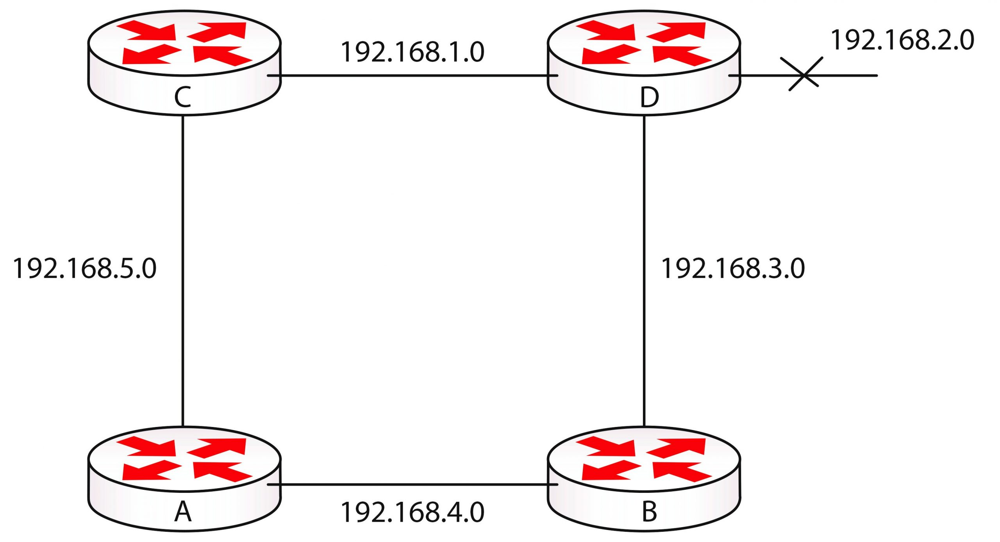

Algunos  de los inconvenientes con estos protocolos son:
- Convergencia lenta en redes muy grandes, debido a los updates periodicos de las tablas completas. 
- Routing loops y conteos hacia el infinito.

## routing loops 
Los routing loops puede provocar castastrofes para la red, estos consumen ancho de banda y recursos causando perdida de información. Además puede tomar tiempo en localizarlo y depurarlo. 
Esto suele suceder principalmente cuando la convergencia de la red es lenta, entonces los routers anuncian routing tables incorrectos. Un router puede perder conexión a la red, pero los demás routers aun no son conscientes del problema. 

### routing loops can happen quickly

Eventualmente, la nueva actualización llega a router C, sin embargo, en ese tiempo, router A piensa que `172.20.0.x` esta todavia activa. Entonces, router A informa a Router D que puede encontrar `172.20.0.x ` (via Router C y B) basado en la información anterior al cambio. Ahora los routers B, C, y D creen que Router A tiene una ruta a la red `172.20.0.x` y enrutan el trafico hacia A.  

Cuando router A recibe el trafico, lo dirige hacia router C (basado en la información anterior, actualmente erronea). Aumentando el TTL (Time to live) en cada salto entre routers (255), esto significa que el paquete sera descartado despues de pasar por los routers 255 veces. Este bucle si bien termina, consume ancho de banda, perdida de rendimiento y degrada la convergencia de la red.

## counting to infinity
Los routing loops puede provocar otro problema, conocido como _counting to infinity_, cuando un paquete viaja a través de la red con un IP al que nunca llega. Esto sucede normalmente porque la red esta deshabilitada, pero pero el router emisor no es conciente de ello. 

Router D anuncia que puede alcanzar la red `192.168.2.0`. Cuando el enlace con esa red falla, router D envia la información correspondiente a los demas routers. Router A (otra vez router A xd), sin embargo, informa que tiene un ruta de dos saltos a `192.168.2.0 ` en su tabla, esta información es enviada a router B, que a su vez, informa a router D sobre que 