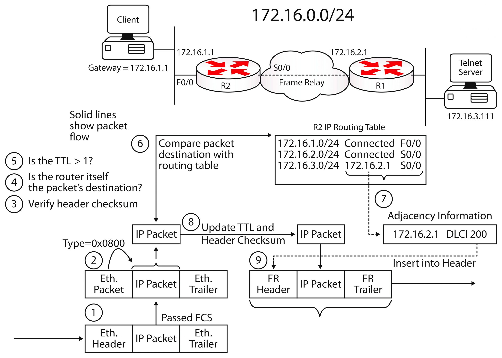

---
tags:
  - routing
  - example
---

Vamos a tomar esta imagen como referencia para explicar el paso a paso que es lo que ocurre.

- Cuando el router recibe un frame (abajo a la izquierda), primero verifica el campo FCS. Si encuentra un error, no salta al siguiente paso y el paquete se descarta. 
- El router revisa el campo 'type' y extrae la data, descartando los headers del 'data link layer' y el trailer.
- El router realiza/verifica el checksum del header del paquete.
- Si el destino del paquete es el mismo router, esta no se reenvia.
- Si el TTL es menor a 1, el paquete se descarta.
- El router verifica si en la tabla de 'ruteo' puede encontrar la ruta más optima para el paquete (esto porque puede haber más de una ruta para llegar al mismo destino). Si no encuentra una ruta para llegar a su destino, el paquete se descarta.
- La tabla de routing debe contener tanto, la interfaz de salida asi como la IP del siguiente salto (o next-hop). Esto es necesario para poder encapsular correctamente el frame, tambien las direcciones de L2 y L3 son requeridas en este punto.
- El TTL se resta un (-1) y se calcula un nuevo checksum.
- Un nuevo FCS es calculado y el frame es encapsulado con los nuevos headers de 'data link' y la dirección de destino. Recordar que la IP de destino no cambia, pero si lo hacen las direcciones de 'data link layer', tanto la de origen como la de destino.