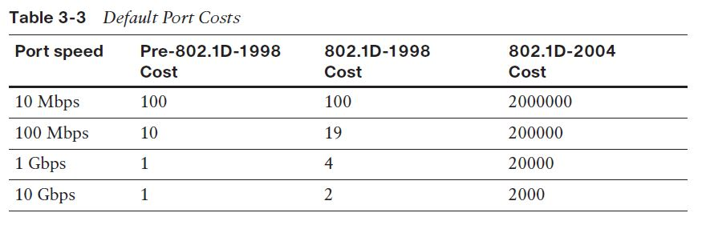

Luego de elegir al Root bridge, cada switch deberá asignar un rol a sus puertos calculando el costo acumulativo hacia el Root bridge (**STP Root Path Cost**) por cada una de sus interfaces.
La interfaz de menor costo se designa como  Root Port (RP).

- El Root Bridge tiene siempre todos sus puertos en rol _Designed (DSGN)_
- Cada switch Non-root tiene obligatoriamente al menos 1 RP
- Una vez elegido el RB, solo este envía BPDUs
	- Es decir, los switches Non-root solo puede reenviar el mensaje BPDU del RB pero ellos no puede generarlo

**Valores por defecto de los _Port Costs_, según los estandares STP lanzados**

_Para nuestro ejemplo concreto y por simpleza, usamos los valores del estandar STP 1998_.

Luego de esto procedemos a la elección de los puertos designados _Ver: [STP - STA, Port roles election - Designed ports](STP%20-%20STA,%20Port%20roles%20election%20-%20Designed%20ports.md)_