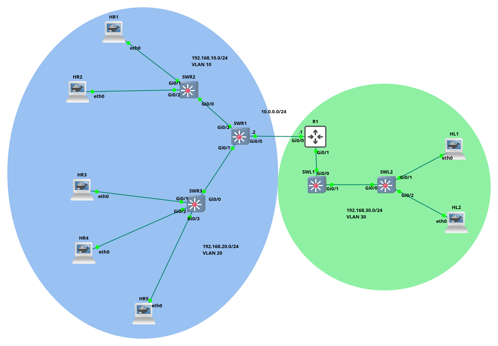

---
tags:
  - DHCP
  - lab
  - CCNA
---

``` bash
# Comandos relevantes para depuración
SW1$ show vlan brief

SW1$ show interfaces trunk

## Esto aplica si tienes instalado nmap en tu contenedor o VM

host1$ nmap --script broadcast-dhcp-discover

```



# Tareas a realizar
- [ ] Configurar los _access ports_ para los switches que tengan interfaces conectadas hacia hosts finales
- [ ] Configurar SWR2 y SWR3 con VTP en modo client
- [ ] Configurar SWR1 con VTP en modo server 
- [ ] Configurar los _trunk ports_ en SWR1, dirigido hacia las interfaces donde se conectan con otros dispositivos L2 (Layer 2)
- [ ] Configuración en SWR1 de las interfaces VLAN para enrutamiento
- [ ] Configuración de SWR1 como servidor DHCP
- [ ] Verificamos que nuestros host reciban una IP a través del DHCP server
- [ ] Configuramos y habilitamos el routing para SWR1 
- [ ] Configuramos el routing en R1
- [ ] Probamos conectividad entre SWR1 y R1 
- [ ] Ahora configuramos la LAN en la que esta la VLAN 30 (excepto DHCP)
	- [ ] Configuramos los access ports (en los switches que tengan hosts) y el VTP client
	- [ ] Configuramos SWL1 como VTP server
	- [ ] Configuramos los trunks ports, pero esta vez no solo dirigido hacia SWL2 sino tambien hacia R1
	- [ ] Configuramos R1 para que pueda conectarse por el trunk port
- [ ] Por ultimo configuramos el ip helper-address en R1 con la IP del siguiente salto despues de R1

En este caso me voy a centrar un poco más en el TS con el comando `show` para verificar que la configuración este en el camino correcto, porque al ser muchos pasos, uno es más propenso a olvidar o confundir ciertos aspectos. Suerte! 

# Resolución 
## Access ports
Comenzamos con la configuración de los access ports en SWR3 y SWR2, vamos a habilitar las tres interfaces en cada switch (en SWR2 solo necesitamos dos en realidad, pero en caso de que queramos conectar un tercer host nos viene bien)

``` bash
# Ejemplo con SWR2

SWR2> en
SWR2$ conf t
SWR2(config)$ int range g0/1-3  # Importante comenzar desde el interface 1, recordar que el interface 0 (en mi red) es para el trunk port
SWR2(config-if-range)$ switchport mode access 
SWR2(config-if-range)$ switchport access vlan 10
SWR2(config-if-range)$ exit

## Podemos corroborar que las vlan esten creadas y asociada a sus interfaces
SWR2(config)$ do show vlan brief
VLAN Name                             Status    Ports
---- -------------------------------- --------- -------------------------------
1    default                          active    Gi0/0, Gi1/0, Gi1/1, Gi1/2
                                                Gi1/3, Gi2/0, Gi2/1, Gi2/2
                                                Gi2/3, Gi3/0, Gi3/1, Gi3/2
                                                Gi3/3
10   VLAN0010                         active    Gi0/1, Gi0/2, Gi0/3
1002 fddi-default                     act/unsup 
1003 token-ring-default               act/unsup 
1004 fddinet-default                  act/unsup 
1005 trnet-default                    act/unsup 
```

Por ultimo habilitamos VTP en modo cliente con el dominio (de ejemplo) `cisco.com` 

```
SWR1(config)$ vtp mode client
SWR1(config)$ vtp domain cisco.com
```

## Trunks ports
Ahora pasamos a SWR1 para configurar los trunks ports, lo que nos permite conectarnos con los otros switches

``` bash
SWR1> en
SWR1$ conf t
SWR1(config)$ vlan 10
SWR1(config-vlan)$ vlan 20
SWR1(config-vlan)$ vlan 30
SWR1(config-if-range)$ int range g0/1-2 
SWR1(config-if-range)$ switchport trunk encapsulation dot1q
SWR1(config-if-range)$ switchport mode trunk
SWR1(config-if-range)$ switchport trunk allowed vlan 10,20,30
SWR1(config-if-range)$ switchport trunk native vlan 1
SWR1(config-if-range)$ exit

## Podemos ver si las VLAN estan creadas con 
SWR1(config)$ do show vlan brief 

VLAN Name                             Status    Ports
---- -------------------------------- --------- -------------------------------
1    default                          active    Gi0/0, Gi0/3, Gi1/0, Gi1/1
                                                Gi1/2, Gi1/3, Gi2/0, Gi2/1
                                                Gi2/2, Gi2/3, Gi3/0, Gi3/1
                                                Gi3/2, Gi3/3
10   VLAN0010                         active    
20   VLAN0020                         active    
30   VLAN0030                         active    
1002 fddi-default                     act/unsup 
1003 token-ring-default               act/unsup 
1004 fddinet-default                  act/unsup 
1005 trnet-default                    act/unsup 

## Tambien podemos ver si tenemos interfaces en modo trunking
SWR1(config)$ do show interfaces trunk 

Port        Mode             Encapsulation  Status        Native vlan
Gi0/1       on               802.1q         trunking      1
Gi0/2       on               802.1q         trunking      1

Port        Vlans allowed on trunk
Gi0/1       10,20,30
Gi0/2       10,20,30

Port        Vlans allowed and active in management domain
Gi0/1       10,20,30
Gi0/2       10,20,30

Port        Vlans in spanning tree forwarding state and not pruned
Gi0/1       10,20,30
Gi0/2       10,20,30
```

 Por ultimo habilitamos VTP en modo server para SWR1
 
> Es importante  aclarar que el dominio debe ser el mismo tanto en el server como en los clientes

``` bash
SWR1(config)$ vtp mode server
SWR1(config)$ vtp domain cisco.com
```

Antes de pasar al siguiente punto quiero volver a los switches (sea SWR2 o SWR3, porque ambos deberían tener la misma configuración) para verificar que hayan recibido el 'trunking' desde SWR1

``` bash
# Ejemplo en SWR3

SWR3(config)$ do show interfaces trunk 

Port        Mode             Encapsulation  Status        Native vlan
Gi0/0       auto             n-802.1q       trunking      1

Port        Vlans allowed on trunk
Gi0/0       1-4094

Port        Vlans allowed and active in management domain
Gi0/0       1,10,20,30

Port        Vlans in spanning tree forwarding state and not pruned
Gi0/0       1,10,20,30
```

 Como podemos ver en este [post](https://community.cisco.com/t5/switching/what-does-n-802-1q-mean-under-trunking/td-p/1365148) del foro de Cisco
 - `n-802.1q` quiere decir que el enlace troncal fue negociado de forma dinámica, no explicita. 
 - En humano, quiere decir que acepto por si mismo la solicitud de trunking que vino desde SWR1 gracias al VTP que configuramos, vamos por buen camino.
	 - Si usamos el mismo comando en SWR1, vemos que solo dice `802.1q` (sin la `n` de negociate) y eso  es porque nosotros configuramos el 'trunking' en ese switch de manera explicita 

## Interfaces VLAN
Ahora (en SWR1) configuramos las interfaces VLAN para enrutamiento (tanto en la VLAN 10 como en la 20, en la 30 NO porque recordar que esa VLAN esta en la otra LAN).

``` bash
# Ejemplo con la VLAN 10

SWR1(config)$ int vlan 10
SWR1(config-if)$ ip address 192.168.10.1 255.255.255.0
SWR1(config-if)$ description VLAN10
SWR1(config-if)$ no shut
SWR1(config-if)$ exit


int vlan 20
ip address 192.168.20.1 255.255.255.0
description VLAN10
no shut
exit
```

## DHCP server
Seguido a eso vamos a configurar el servidor [DHCP](DHCP.md) para que nuestros hosts de las VLAN 10, 20, 30 puedan recibir un IP de forma dinámica.


``` bash
# ejemplo con VLAN10

SWR1(config)$ ip dhcp pool VLAN10
SWR1(dhcp-config)$ network 192.168.10.0 255.255.255.0
SWR1(dhcp-config)$ default-router 192.168.10.1
SWR1(dhcp-config)$ dns-server 1.1.1.1   
```

En este punto ya deberiamos tener DHCP funcionando para nuestros hosts. Voy a encender el host HR3 perteneciente a la VLAN 20.
> Antes de encender el host debemos hacer un par de cosas para que host pueda comenzar a un enviar mensajes en busqueda del DHCP server 
> #TODO Agregar una entrada al problema de DHCP

``` bash
Trying 192.168.0.105...
Connected to 192.168.0.105.
Escape character is '^]'.
HR3 console is now available... Press RETURN to get started.
udhcpc: started, v1.30.1
udhcpc: sending discover
udhcpc: sending select for 192.168.20.4
udhcpc: lease of 192.168.20.4 obtained, lease time 86400
Welcome to fish, the friendly interactive shell
Type help for instructions on how to use fish

root@HR3 /$ 

# Vemos que udhcpc envio el DHCP discover y el servidor respondio a su petición hasta asignarle la IP 192.168.20.4
```

## Routing 
Ahora es turno de configurar el routing entre switch MLS SWR1 y el router R1, comenzamos con SWR1.

``` bash
# Ingresamos a Gi0/0 que es la interface que esta conectada hacia el router
SWR1(config)$ int g0/0
SWR1(config-if)$ no switchport
SWR1(config-if)$ ip address 10.0.0.2 255.255.255.252
SWR1(config-if)$ ip route 0.0.0.0 0.0.0.0 10.0.0.1
SWR1(config)$ ip routing  # Habilitamos el routing en SWR1

## 10.0.0.1 es la IP del siguiente salto al salir de la red, es decir pertenece a Gi0/0 de R1 que vamos a configurar despues de esto


# Verificamos
SWR1(config)$ do show ip interface g0/0
GigabitEthernet0/0 is up, line protocol is up
  Internet address is 10.0.0.2/30
  Broadcast address is 255.255.255.255
  Address determined by setup command
  MTU is 1500 bytes
  ...

```

Ahora pasamos a R1 para configurar el enrutamiento sobre la red `10.0.0.0/30` tal como lo hicimos en SWR1.

``` bash
# R1

R1(config)$ int g0/0
R1(config-if)$ no shut
R1(config-if)$ ip address 10.0.0.1 255.255.255.252
R1(config-if)$ ip route 0.0.0.0 0.0.0.0 10.0.0.2

## Le asignamos la IP 10.0.0.1/30 con el gateway 10.0.0.2 (SWR1)


# Verificamos 
R1(config)$ do show ip interface
GigabitEthernet0/0 is up, line protocol is up
  Internet address is 10.0.0.1/30
  Broadcast address is 255.255.255.255
  Address determined by setup command
  MTU is 1500 bytes

```

En este punto ya tenemos comunicación entre SWR1 y R1. Vamos a realizar ping en ambos lados para confirmar esto.

``` bash
# R1
R1(config)$ do ping 10.0.0.2   
Type escape sequence to abort.
Sending 5, 100-byte ICMP Echos to 10.0.0.2, timeout is 2 seconds:
!!!!!
Success rate is 100 percent (5/5), round-trip min/avg/max = 2/2/3 ms

# SWR1
SWR1(config)$ do ping 10.0.0.1
Type escape sequence to abort.
Sending 5, 100-byte ICMP Echos to 10.0.0.1, timeout is 2 seconds:
!!!!!
Success rate is 100 percent (5/5), round-trip min/avg/max = 1/2/5 ms
```

## VLAN 30
Podemos decir que la LAN dentro del coso azul y que contiene a la VLAN 10 y 20 esta configurada. Ahora toca configurar la LAN de la izquierda que contiene a la VLAN 30. Para no hacer más largo esto y porque _estoy cansado jefe_. Dejo que lo hagan ustedes y yo me dedico a mostrar las cuestiones que no entraron antes. Solo a tener en cuenta y como ayuda.
- SWL2 debe tener a G0/1-2 como access ports y el trafico habilitado para la VLAN 30
- Configurar SWL2 para como VTP client
- Configurar SWL1 como VTP server 
- Configurar el trunk port entre SWL1 y SWL2, este ultimo deberia recibir `n-802.1q` gracias a VTP
- Aqui viene la primera diferencia, la conexión entre SWL1 y R1 es de tipo trunk, debemos configurar el router R1 para que se comunique de esa manera. Algo que ya se vio en [VLAN in Routers](VLAN%20in%20Routers.md) 
- Por ultimo configuramos el DHCP helper-address para que se puedan asignar IPs de forma dinámica desde el servidor SWR1 que se encuentra en la otra LAN


# Trunk port, router 
Vamos a configurar R1 para pueda conectarse con SWL1 a través del trunk port.

``` bash
# R1, configuramos el Gi0/1 que esta conectada a SWL1

R1(config)$ int g0/1
R1(config-if)$ no shut
R1(config-if)$ int g0/1.30 
R1(config-subif)$ encapsulation dot1q 30
R1(config-subif)$ ip address 192.168.30.1 255.255.255.0 

## Verificamos
R1(config-subif)$ do show ip int brief
Interface                  IP-Address      OK? Method Status                Protocol
GigabitEthernet0/0         10.0.0.1        YES manual up                    up      
GigabitEthernet0/1         unassigned      YES NVRAM  up                    up      
GigabitEthernet0/1.30      192.168.30.1    YES manual up                    up      
GigabitEthernet0/2         unassigned      YES NVRAM  administratively down down    
GigabitEthernet0/3         unassigned      YES NVRAM  administratively down down    
```

Tambien configurar SWL1 para habilitar el trunk port, la configuración es de la misma forma como ya lo hicimos antes. Solo que habilitamos el paso para la VLAN 30.

Antes de pasar al DHCP helper-address y como ya esta configurado el enrutamiento en la VLAN 30, podemos probar si tenemos conectividad entre el router y los hosts finales. En mi caso voy a usar HL1, pero como no tenemos DHCP en la LAN. Vamos a configurar de forma estática la IP y el gateway en el host.

``` bash
# HL1

root@HL1 /$ ip addr add 192.168.30.2/24 dev eth0
root@HL1 /$ ip route add default via 192.168.30.1 dev eth0


# Ahora probamos hacer ping hacia el router 
root@HL1 /$ ping -c 1 192.168.30.1
PING 192.168.30.1 (192.168.30.1) 56(84) bytes of data.
64 bytes from 192.168.30.1: icmp_seq=1 ttl=255 time=6.25 ms

--- 192.168.30.1 ping statistics ---
1 packets transmitted, 1 received, 0% packet loss, time 0ms
rtt min/avg/max/mdev = 6.247/6.247/6.247/0.000 ms
root@HL1 /$ hola!  
```

Como ultimo paso tenemos que configurar R1 como helper-address para que el router se encargue de enviar la solicitud hasta el servidor DHCP.  

``` bash
# En R1 configuramos el DHCP helper-address con la IP address del siguiente salto del router, es decir SWR1
R1(config-subif)$ ip helper-address 10.0.0.2
```

Por ultimo voy a encender HL2 (que ya esta configurado para buscar un DHCP server). Y deberia asignarnos una IP que proviene desde SWR1 en la otra LAN.
#TODO etiquetar el dhcp problem

``` bash
udhcpc: started, v1.30.1
udhcpc: sending discover
udhcpc: sending select for 192.168.30.4
udhcpc: lease of 192.168.30.4 obtained, lease time 86400
Welcome to fish, the friendly interactive shell
Type help for instructions on how to use fish

root@HL2 /$ ifconfig
eth0: flags=4163<UP,BROADCAST,RUNNING,MULTICAST>  mtu 1500
        inet 192.168.30.4  netmask 255.255.255.0  broadcast 0.0.0.0
        ether 26:32:26:61:f1:b9  txqueuelen 1000  (Ethernet)
        RX packets 11  bytes 1234 (1.2 KiB)
        RX errors 0  dropped 0  overruns 0  frame 0
        TX packets 4  bytes 864 (864.0 B)
        TX errors 0  dropped 0 overruns 0  carrier 0  collisions 0

lo: flags=73<UP,LOOPBACK,RUNNING>  mtu 65536
        inet 127.0.0.1  netmask 255.0.0.0
        inet6 ::1  prefixlen 128  scopeid 0x10<host>
        loop  txqueuelen 1000  (Local Loopback)
        RX packets 0  bytes 0 (0.0 B)
        RX errors 0  dropped 0  overruns 0  frame 0
        TX packets 0  bytes 0 (0.0 B)
        TX errors 0  dropped 0 overruns 0  carrier 0  collisions 0

```

Fin! 