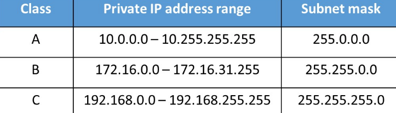

---
tags:
  - general
  - CCNA
---

IP (Internet Protocol) es un protocolo [[L3 - Network Layer]] que sirve como esquema de direccionamiento lógico (la cual la diferencia de L2). Sirve para poder identificarnos en la red, también se puede particionar en varias partes llamadas subredes. Generalmente, se compone de cuatro octetos (8 bits) dado por: 
$$Porción\ de\ RED + Porcion\ de\ HOST$$

![[Pasted image 20241016084948.png]]

# TODO: agregar concepto de peso en el sistema binario

### IP address range

### Calcular IPs disponibles para host
Esto se hace usando la formula $2^{x}$ siendo $x$ la cantidad de bits disponibles en la porción de host. 
- Por ejemplo en un rango clase A, tenemos 24 bits. Entonces tenemos disponibles $2^{24}$ host disponibles, es decir $16.777.216$ hosts disponibles
- Por ejemplo en un rango clase B, tenemos 16 bits. Entonces tenemos disponibles $2^{16}$ host disponibles, es decir $65.536$ hosts disponibles
- Por ejemplo en un rango clase C, tenemos 8 bits. Entonces tenemos disponibles $2^8$ host disponibles, es decir $256$ hosts disponibles

### Tipos de Ip address
- Direccion de red  (dirección de host AND subnet mask)
- Direccion de enlace (es la dirección siguiente a la dirección de red)
- Direcciones IP de Host
- Direcciones IP de Gateway (Puerta de enlace)
- Direcciones Broadcast
- Wildcard (subnet mask OR 255.255.255.255 )

### Direccionamiento de la red
Cuando hay dispositivos conectados a un switch forman parte de la misma red.
En cambia si hay dispositivos conectados a un router. Cada dispositivo esta en una red independiente. Aun solo sea un dispositivo.
