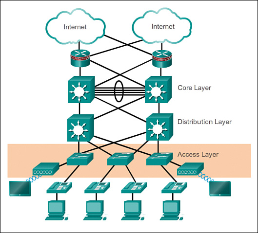

---
tags:
  - general
  - CCNA
---

- Red pequeña: servicio para hasta 200 dispositivos
- Red mediana: servicio desde 200 a 1000 dispositivos
- Red grande: servicio para más de 1000 dispositivos

## LAN jerarquica de campus empresarial
Lo ideal es que cada capa sea independiente de otras y a su vez tengan definidas su funcion dentro de la red
- Capa de acceso: proporciona acceso a la red para los grupos de trabajo y los usuarios. Es la capa mas cercana a un dispositivo final. 
- Capa de distribución: proporciona una conectividad basada en politicas (NAC y ACLs) y controla el limite entre las capas de acceso y de nucleo.
- Capa de nucleo: proporciona un transporte rapido entre los switches de distribucion dentro del campus empresarial

_La conexión de cuatro cables y un aro (en Core Layer) hace referencia a una conexión etherchannel. Ver: [Etherchannel](Etherchannel.md)_

### Diseño de red empresarial en varios edificios
TODO

### Funciones en _Access Layer_
- Switching de L2
- Alta disponibilidad
	- Esto es gracias a los enlaces redundantes de la Access Layer que conectan los switches de Access Layer a los switches multicapa pertenecientes al Distribution Layer
- Seguridad de puerto
- Clasificacióny marcación de QoS, y limites de confianza
- Listas de control de acceso virtual (VACL)
- Arbol de expansión (_Ver: [STP](Project/Networking/CCNA-notas/(LEGACY)%20Layer%202%20concepts/(LEGACY)%20STP/STP.md)_)
- Alimentacion por ethernet y VLAN auxiliares para VoIP
### Funciones en _Distribution Layer_
- Agregación de enlaces LAN o WAN
	- Esto conlleva a la configuración de los enlaces etherchannel y para la redundancia entre el Core Layer y el Access Layer
- Seguridad basada en politicas en forma de listas de control de acceso (_Ver: [ACL](../../Security/ACL/ACL.md)_) y filtrado
- Servicios de routing entre redes LAN y VLAN y entre dominios de routing (p. ej. EIGRP a OSPF)
- Redundancia y balanceo de carga
- Un limite para la agregacion y la sumarizacion de rutas que se configura en las interfaces hacia la capa de nucleo
- Control del dominio de difusion, ya que ni los routers ni los switches multicapa reenvian difusiones. El dispositivo funciona como punto de demarcacion entre los dominios de difusion

### Funciones en _Core Layer_
- Debe proporcionar switching de alta velocidad
- Debe proporcionar confiabilidad y tolerancia a fallas
- Debe lograr la escalabilidad mediante equipos mas rapidos, calidad sobre cantidad
- Debe evitar la manipulacion de paquetes que implica una gran exigencia en la CPU a causa de la seguridad, la inspeccion, la clasificacion de la calidad de servicio (QaS) u otros procesos

# CISCO SBA FOR ENTERPRISE ORGANIZATION

## Principios de ingenieria estructura
- Jerarquia 
- Modularidad
- Resistencia
- Flexibilidad